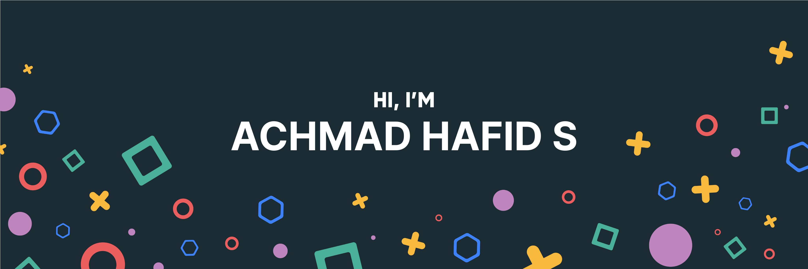

  
  
  
  

  <em>Flutter Developer | Mobile App Specialist | Tech Enthusiast</em>

 

## 🌟 About Me

Hello! I'm Achmad Hafid Supriyadi, a dedicated Flutter developer with a passion for creating seamless and high-performance mobile applications. I am enthusiastic about new technologies and love turning ideas into reality through code.

- 🌍 Based in: Indonesia
- 🔭 Currently working on: PT. Imagine Space Technology & Printsoft
- 🌱 Learning: Advanced state management in Flutter, backend integration
- 💬 Ask me about: Flutter development, mobile app architecture, state management

## 🛠️ Skills

### Languages & Frameworks

### Tools & Technologies

### UI/UX Design

## 📈 GitHub Stats

  

## 🏆 Top Repositories

  

## 📫 Connect with Me

  
  
  
  

---

 ⭐️ From Achmad <a href="https://mrhafid.my.id" style="text-decoration:none;">Achmad Hafid Supriyadi</a>

