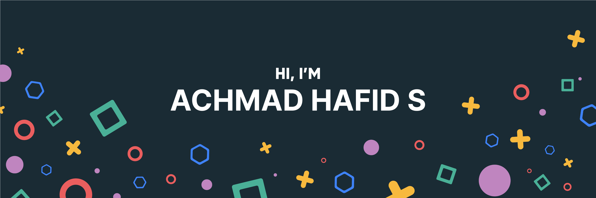

# Hi there, I'm Achmad Hafid Supriyadi 👋

  
  
  
  

  <em>Flutter Developer | Mobile App Specialist | Tech Enthusiast</em>

## 🌟 About Me

Hello! I'm Achmad Hafid Supriyadi, a dedicated Flutter developer with a passion for creating seamless and high-performance mobile applications. I am enthusiastic about new technologies and love turning ideas into reality through code.

- 🌍 Based in: Indonesia
- 🔭 Currently working on: PT. Imagine Space Technology || Printsoft
- 🌱 Learning: Advanced state management in Flutter, backend integration
- 💬 Ask me about: Flutter development, mobile app architecture, state management

## 🛠️ Skills

### Languages & Frameworks

### Tools & Technologies

### UI/UX Design

## 🚀 Projects

### [Project Name](https://github.com/yourusername/project-repo)
> **Description:** A brief description of the project and its purpose. Highlight key features and technologies used.

  

### [Another Project](https://github.com/yourusername/another-project-repo)
> **Description:** A brief description of the project and its purpose. Highlight key features and technologies used.

  

## 📈 GitHub Stats

  

## 🏆 Top Repositories

  

## 📫 Connect with Me

  
  
  
  

---

  ⭐️ From [Your Name](https://github.com/yourusername)

